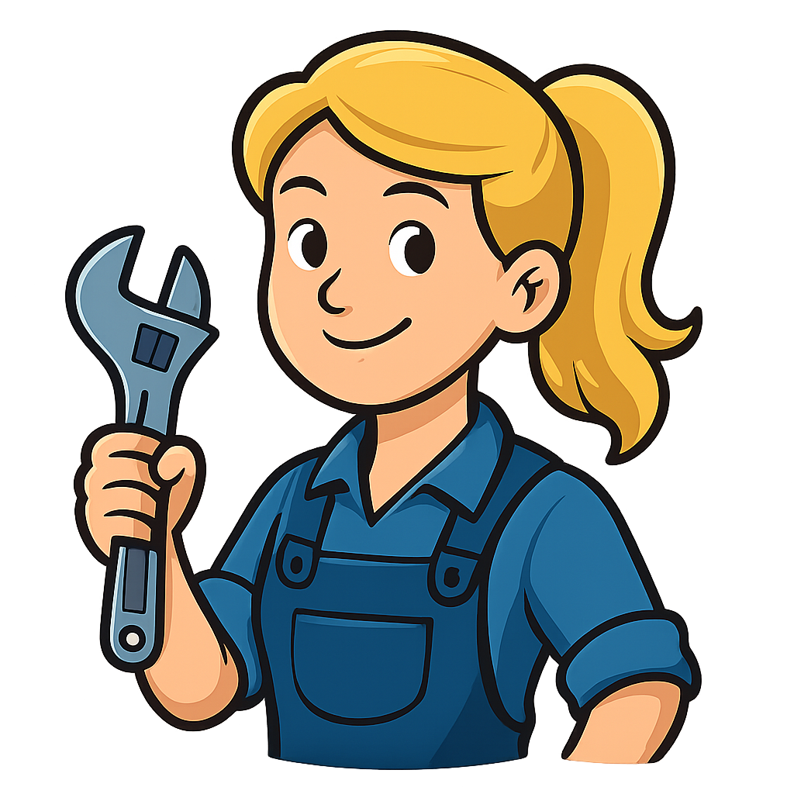
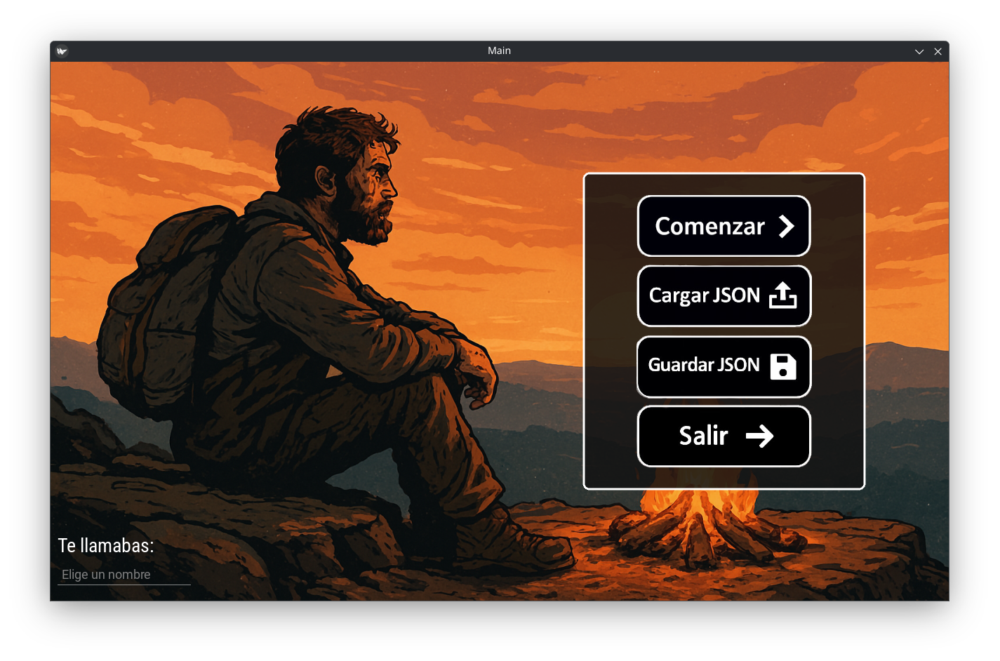
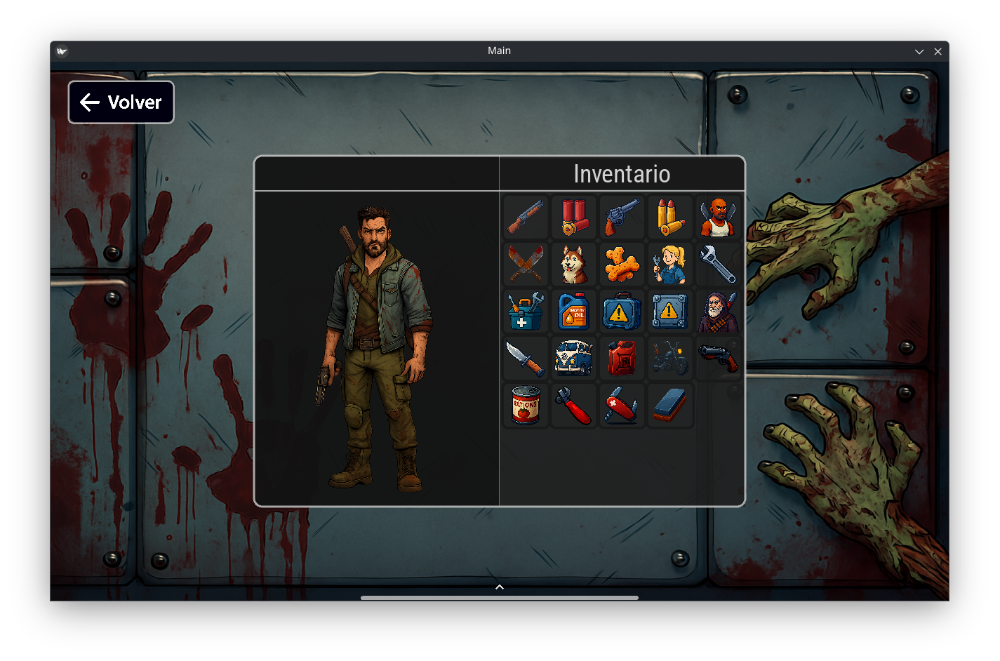
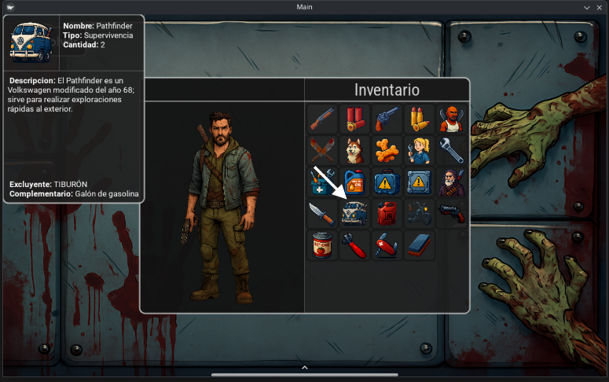
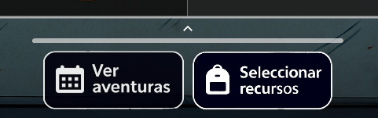
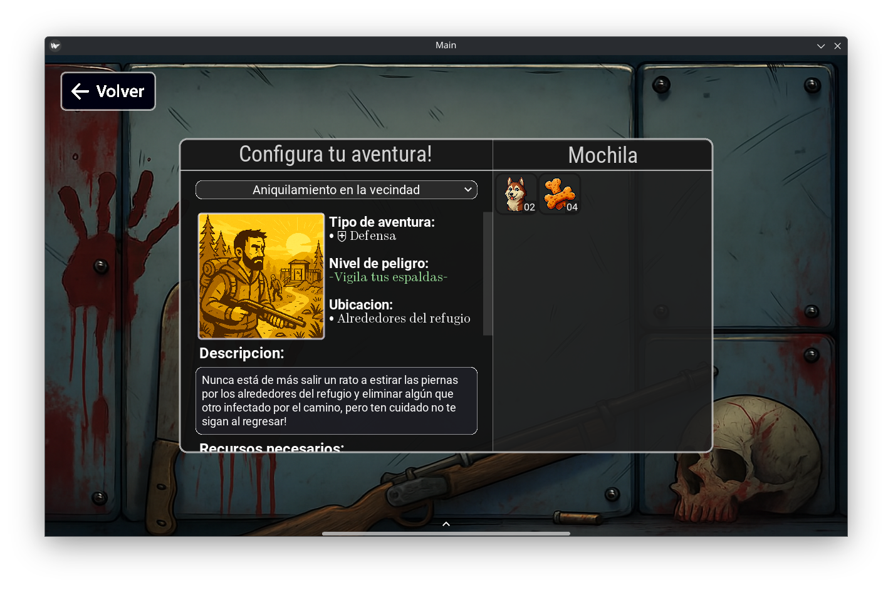
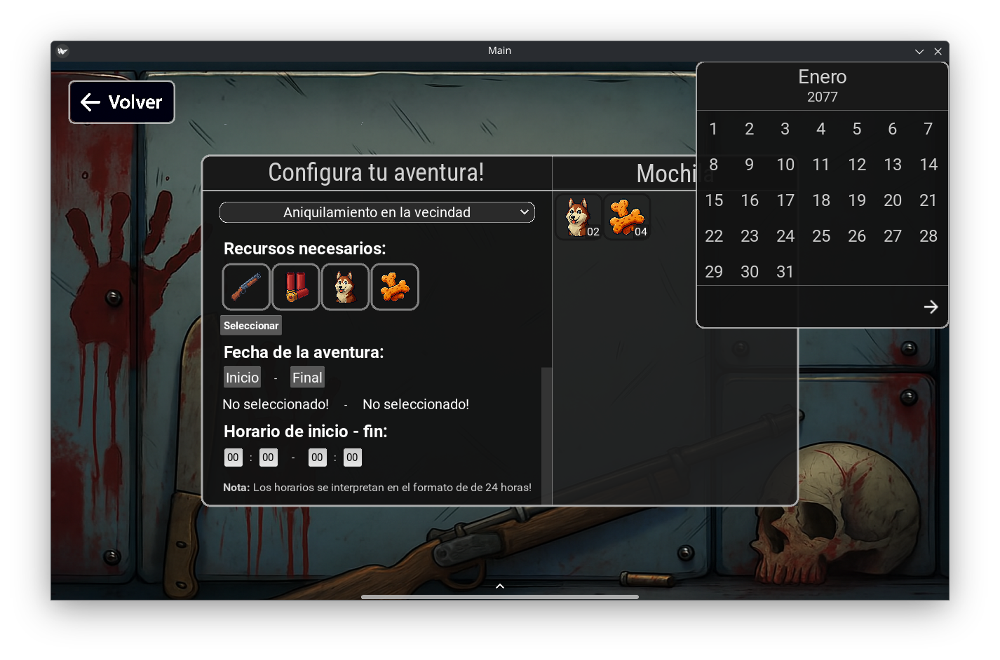
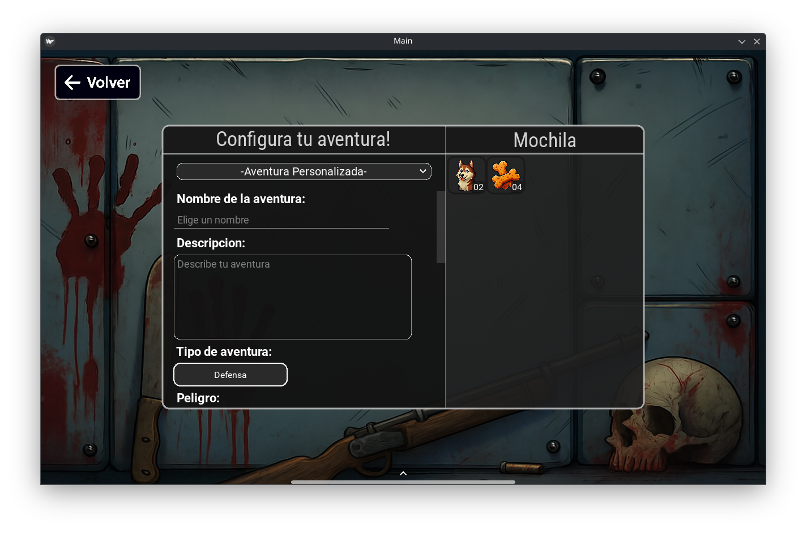
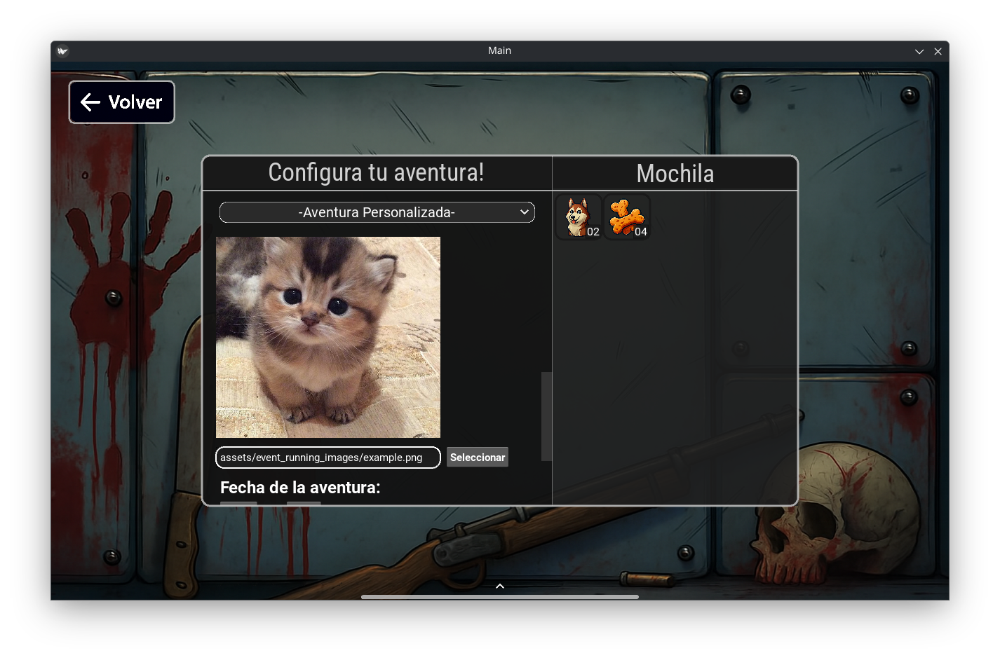

# Event Manager Apocalipsis

Bienvenido a **Event Manager Apocalipsis**, una herramienta de gestión de supervivencia diseñada para administrar recursos y eventos en un refugio post-apocalíptico.

## 🌐 Dominio del Proyecto
El dominio elegido es una **Apocalipsis Zombie**. 

**¿Por qué?**
Este escenario permite explorar la gestión de recursos limitados bajo presión, la toma de decisiones estratégicas y la planificación de eventos críticos. Combina la lógica de inventario con una narrativa de supervivencia inmersiva, ofreciendo un desafío interesante tanto a nivel de programación como de experiencia de usuario.

Al ser un tema icónico en la cultura popular —presente en cine, videojuegos y literatura—, resulta fascinante colocar al usuario en el rol de líder de un refugio postapocaliptico. Este programa actúa como un **gestor de eventos** administrativo, cuyo propósito es brindar la interfaz necesaria para organizar misiones y administrar los recursos vitales para la supervivencia. Todo ello enmarcado en una realidad distópica donde la humanidad enfrenta la extinción a causa de un hongo parásito que transforma a sus huéspedes en criaturas hostiles.

## 🧟 Eventos y Recursos

### Eventos (Aventuras)
Los eventos, también denominados **aventuras**, son situaciones que planificaria el lider para asegurar la supervivencia del refugio. Se clasifican en 3 tipos: **Defensa**, **Refugio** y **Supervivencia**.

- **Defensa:** Actividades orientadas a la protección del perímetro, eliminación de amenazas cercanas y mantenimiento del arsenal bélico.
- **Refugio:** Tareas internas de mantenimiento y reparación de las instalaciones del refugio.
- **Supervivencia:** Expediciones peligrosas al exterior para la recolección de suministros, rescate de supervivientes y exploración de zonas desconocidas.

A continuación se listan los eventos predefinidos disponibles en el sistema. Estos eventos cuentan con un conjunto mínimo de recursos necesarios para su ejecución; no obstante, es posible asignar recursos adicionales si se considera oportuno. Además, el sistema permite la creación de **eventos personalizados**, que permiten al usuario elegir libremente sus recursos y especificaciones.

#### Lista de Eventos Predefinidos:

- **Aniquilamiento en la vecindad:** Salidas rutinarias para limpiar los alrededores del refugio de infectados.
- **Expedición al bunker abandonado:** Misiones peligrosas para reducir la amenaza de ataques masivos desde el bunker del sur.
- **Limpieza de carreteras:** Despejar las rutas cercanas para asegurar una vía de escape en caso de emergencia.
- **Preparar el armamento:** Mantenimiento preventivo de las armas en el cuarto de armamento.
- **Vuelvete tramposo!:** Instalación y mejora de trampas en el patio exterior para la defensa del refugio.
- **Podar el jardin:** Despejar el perímetro del refugio cuando los infectados rompen la cerca electrificada.
- **Bombillas defectuosas:** Mantenimiento de las torres de iluminación.
- **Tapar los agujeros:** Reparación de fisuras en puertas y ventanas para evitar intrusiones.
- **Depurar H2O:** Cambio de filtros en el módulo de purificación para asegurar agua potable.
- **Ir de compras:** Expediciones a supermercados abandonados para conseguir víveres.
- **Pasaje a lo desconocido:** Exploración de las fronteras de la ciudad en busca de nuevos horizontes.
- **Eliminar colmena:** Ataques directos a los epicentros de infección (Área 0) para reducir drásticamente la amenaza.
- **Recetas de plomo:** Búsqueda de medicinas y reactivos en hospitales abandonados.
- **Buscar chatarra:** Recolección de materiales y piezas en cementerios de autos.
- **Rescatar supervivientes:** Misiones humanitarias en refugios infectados para encontrar aliados.
- **Visita programada:** Defensa activa contra hordas provenientes del vecindario de lujo cercano.
- **Control de bugs:** Diagnóstico y reparación preventiva de anomalías dentro del refugio.
- **Atender cultivos:** Cuidado de los huertos en el patio exterior para asegurar alimento fresco.

Cada evento tiene un nivel de **peligro**, una **ubicación** y una lista de **recursos necesarios** asignada. Adicionalmente, cada evento tendrá una **fecha y hora de inicio** y **fin**, con una **duración mínima de 24 horas**.

> **Nota:** Las etiquetas de **peligro** y **ubicación** son más que nada elementos de ambientación y no influyen en la lógica del gestor.

### Recursos
Los recursos son los bienes materiales y humanos disponibles en el refugio. Cada recurso pertenece a un **tipo** específico y tiene una **cantidad limitada**.

| Imagen | Nombre | Descripción | Tipo | Complementario | Excluyente | Cantidad |
| :---: | :--- | :--- | :--- | :--- | :--- | :---: |
|  | **Escopeta de caza** | Escopeta de caza calibre .50; ten cuidado donde apuntas al apretar el gatillo o podrías acabar decorando el techo del refugio. | Defensa | Balas de escopeta | Baby Shark | 4 |
|  | **Balas de escopeta** | Balas de escopeta; puede que los magos las detengan con la boca, pero los infectados no son magos. | Defensa | Escopeta de caza | Balas del Baby Shark | 12 |
|  | **Baby Shark** | El mote de este revólver Magnum calibre .44 fue puesto por el abuelo, quien afirmaba que se podían cazar tiburones con él. | Defensa | Balas del Baby Shark | Escopeta de caza | 5 |
|  | **Balas del Baby Shark** | Balas para revólver calibre .44; pueden usarse con el Baby Shark; tienen tallado un tiburón con zapatos. | Defensa | Baby Shark | Balas de escopeta | 18 |
|  | **Emigrante cubano** | Estos emigrantes son antiguos cortadores de caña de azúcar en su tierra natal Cuba. No les gustan nada los perros. Dicen que son capaces de cortar cualquier cosa con sus machetes; aunque nadie que piense lo contrario ha vivido para contarlo. | Defensa | Machetes oxidados | Husky del refugio | 5 |
|  | **Machetes oxidados** | Solo los cortadores de caña saben cómo usar estos machetes oxidados; no les gusta que los toquen. | Defensa | Emigrante cubano, Piedra de afilar | Galletas en forma de hueso | 5 |
|  | **Husky del refugio** | Estos cachorros de husky siberiano fueron los únicos supervivientes, junto al abuelo Polkish, del ataque que sufrió el actual refugio antes de nuestra llegada; les gustan mucho las galletas. | Defensa, Refugio | Galletas en forma de hueso | Emigrante cubano | 7 |
|  | **Galletas en forma de hueso** | Estas galletas son las favoritas de los husky; lánzaselas encima de los caminantes y deja que hagan el trabajo. | Defensa, Refugio | Husky del refugio | Machetes oxidados | 14 |
|  | **Milly, la mecánica** | El primer juguete que Milly tuvo en la infancia fue una llave inglesa; siempre estuvo muy unida a su padre y desde que este falleció en los sucesos de la primera oleada no ha sido la misma. Ahora lucha junto a tu grupo para encontrar la cura al virus. | Refugio | Llave inglesa de papá | Raciones enlatadas | 1 |
|  | **Llave inglesa de papá** | El primer juguete que tuvo Milly le dio su padre. Puede reparar cualquier cosa. | Refugio | Milly, la mecánica | Abrelatas | 1 |
|  | **Kit de Mantenimiento de Refugio (KMR)** | Este kit creado por Milly permite dar mantenimiento a las maquinarias del refugio sin tener grandes conocimientos de mecánica; no contiene instrucciones. | Refugio | Aceite de motor | Kit de Seguridad de Refugio (KSR) | 6 |
|  | **Aceite de motor** | Aceite de motor común y corriente, ideal para maquinarias chirriantes. | Refugio | Kit de Mantenimiento de Refugio (KMR) | Placa reforzante | 4 |
|  | **Kit de Seguridad de Refugio (KSR)** | Este kit creado por el abuelo es lo mejor para realizar reparaciones en las áreas más sensibles del refugio; después de la última oleada fue perfeccionado y actualizado. | Refugio | Placa reforzante | Kit de mantenimiento de Refugio (KMR) | 8 |
|  | **Placa reforzante** | Como su nombre indica, esta placa fabricada con fibra de carbono puede reforzar cualquier tipo de estructura del refugio con tan solo un par de martillazos; se instala con el KSR. | Refugio | Kit de Seguridad de Refugio (KSR) | Aceite de motor | 12 |
|  | **Polkish, el abuelo** | Al abuelo Polkish lo encontramos en nuestro actual refugio junto a su adorable Husky del refugio, es un experto en exploración y supervivencia | Refugio, Supervivencia | Ziggy el filoso | Navaja suiza de Osvaldo | 1 |
|  | **Ziggy el filoso** | Este cuchillo Bowie pertenece al abuelo; tiene un filo descomunal, parece que fue traído de otro planeta. | Supervivencia | Polkish, el abuelo, Piedra de afilar | Piedra de afilar | 1 |
|  | **Pathfinder** | El Pathfinder es un Volkswagen modificado del año 68; sirve para realizar exploraciones rápidas al exterior. | Supervivencia | Galón de gasolina | TIBURÓN | 2 |
|  | **Galón de gasolina** | Un galón de gasolina; huele rico. | Supervivencia | Pathfinder, TIBURÓN | Aceite de motor | 8 |
|  | **TIBURÓN** | Estas motos pertenecieron al abuelo en sus años de juventud cuando formaba parte de una banda de motoristas exploradores; están equipadas con una escopeta cartucho adaptada. | Supervivencia, Defensa | Galón de gasolina, Escopeta recortada adaptada | Pathfinder | 3 |
|  | **Escopeta recortada adaptada** | Escopeta recortada italiana de 2 proyectiles; el abuelo la llama 'Abremundos'. | Supervivencia, Defensa | TIBURÓN | Escopeta de caza | 3 |
|  | **Raciones enlatadas** | Comida enlatada ideal para todo tipo de exploración; no tiene mucho sabor. | Supervivencia | Abrelatas | Milly, la mecánica | 15 |
|  | **Abrelatas** | Abrelatas marca OpenAll; sirve para abrir todo tipo de latas. | Supervivencia | Raciones enlatadas | Llave inglesa de papá | 3 |
|  | **Navaja suiza de los emigrantes** | Navaja suiza hecha en Cuba; sirve para todo. | Supervivencia, Refugio, Defensa | Piedra de afilar | Polkish, el abuelo | 5 |
|  | **Piedra de afilar** | Piedra de afilar para filos menores; aunque los emigrantes cubanos las usan con sus machetes. | Supervivencia, Refugio, Defensa | Navaja suiza de los emigrantes, Machetes oxidados | Ziggy el filoso | 3 |

#### ⚙️ Restricciones 

En este mundo hostil, la gestión inteligente del inventario es la clave para no perecer. Los recursos no son simples objetos aislados; interactúan entre sí de formas que pueden salvarte la vida o condenarte.

**Recurso Complementario:**
Es aquel recurso indispensable para que otro funcione. Imagina intentar disparar un arma sin balas o conducir un vehículo sin gasolina; en el apocalipsis, un objeto incompleto es solo peso muerto.

**Recurso Excluyente:**
Es aquel recurso que no puede coexistir con otro en la misma misión. Ya sea por rivalidades personales (como la de los emigrantes y los perros), limitaciones de espacio en el transporte o incompatibilidad técnica.

#### Ejemplos de Restricciones:

**Complementariedad (Se necesitan mutuamente):**
1.  **Escopeta de caza** y **Balas de escopeta**: Un arma sin munición es inútil contra los infectados.
2.  **Raciones enlatadas** y **Abrelatas**: Para consumir las provisiones durante una expedición, es indispensable la herramienta para abrirlas.
3.  **Pathfinder** y **Galón de gasolina**: El vehículo modificado requiere combustible para realizar los viajes de exploración.

**Exclusión (No pueden ir juntos):**
1.  **Emigrante cubano** y **Husky del refugio**: Los emigrantes tienen una fuerte aversión a los perros, lo que genera conflictos en el grupo.
2.  **Escopeta de caza** y **Baby Shark**: Por cuestiones de logística y peso, no es viable cargar con ambos arsenales simultáneamente.
3.  **Kit de Mantenimiento (KMR)** y **Kit de Seguridad (KSR)**: Se debe priorizar un enfoque de reparación (mecánico o estructural) para no sobrecargar el inventario con herramientas redundantes.

> **Nota:** En algunos casos, un recurso puede tener más de un recurso **complementario**. Esto significa que para poder utilizarlo, es necesario llevar **al menos uno** de los recursos listados como complementarios.

## 🛠️ Funcionalidades y Mecánicas

*   **Gestión de Eventos:** Planificación y seguimiento de misiones críticas con fechas de inicio, fin y duración.
*   **Visualización Temporal:** Generación de **Diagramas de Gantt** con **Matplotlib** para visualizar la duración y solapamiento de las misiones en el tiempo.
*   **Sistema de Inventario Lógico:** Manejo de recursos mediante **pools de cantidad limitada**, junto con reglas complejas de **complementariedad** y **exclusión**
*   **Persistencia y Portabilidad:** Capacidad de **cargar y guardar** el estado completo de la lista de eventos en archivos JSON, permitiendo respaldos y gestión manual de archivos.
*   **Interfaz Gráfica (GUI):** Construida con **Kivy**, ofreciendo una experiencia visual interactiva y temática.
*   **Ambientación Inmersiva:** Textos y descripciones diseñados para sumergir al usuario en la narrativa de supervivencia.


## 🚀 Ejecución y Uso

### Requisitos Previos
Asegúrate de tener Python instalado. Se recomienda usar un entorno virtual.

1.  **Instalar dependencias:**
    ```bash
    pip install -r requirements.txt
    ```

### Ejecutar el Programa
Para iniciar la aplicación, ejecuta el archivo principal desde la terminal:

```bash
python main.py
```

## 🖥️ Guía de la Interfaz

A continuación, se presenta una guía detallada para navegar y utilizar las diferentes secciones de la aplicación.

### 1. Menú de Inicio



Al ejecutar la aplicación, te encontrarás con el **Menú de Inicio**, tu punto de partida en el apocalipsis. Aquí encontrarás las siguientes opciones:

1.  **Comenzar:** Te lleva directamente a la sección principal de gestión, donde podrás administrar tus recursos y eventos.
2.  **Cargar JSON:** Abre un explorador de archivos que te permite navegar por tus directorios locales para cargar un archivo JSON con eventos previamente guardados o configuraciones externas. *Nota: El archivo debe cumplir con la estructura de datos esperada por la aplicación.*
3.  **Guardar JSON:** Guarda el estado actual de tus aventuras y eventos en curso en un archivo JSON, permitiéndote respaldar tu progreso cómodamente para usarlo luego sin tener que manejar los archivos manualmente.
4.  **Salir:** Cierra la aplicación de forma segura.

Además, en la esquina inferior izquierda, encontrarás un campo de texto donde puedes ingresar tu **Nombre de Usuario**, personalizando así tu experiencia como líder del refugio.

### 2. Inventario de Recursos



Tras pulsar **Comenzar** en el menú anterior, accederás a esta ventana, el corazón logístico de tu refugio.

*   **Navegación:** En la esquina superior izquierda encontrarás un botón de **Volver** para regresar al menú de inicio.
*   **Panel Central:**
    *   **Líder del Refugio (Izquierda):** Muestra tu apariencia como líder y, justo encima, el nombre que elegiste en el menú anterior (opcional).
    *   **Inventario (Derecha):** Despliega todos los recursos disponibles.
        *   **Selección:** Al hacer clic sobre un recurso, el color de su borde cambiará para indicar que ha sido **seleccionado**.
        *   **Deselección:** Si vuelves a tocar un recurso seleccionado, sus bordes recuperarán el color original, indicando que ha sido **deseleccionado**.

#### Detalles del Recurso



Si pasas el cursor por encima de cualquier recurso en el inventario, aparecerá un panel en la esquina superior izquierda con información detallada sobre el mismo (nombre, descripción, tipo, etc.)

#### Panel de Acciones



Al colocar el cursor sobre el área inferior, cercana a la pequeña flecha que apunta hacia arriba, se desplegará este panel inferior que contiene los botones de **Ver Aventuras** y **Seleccionar Recursos**.

*   **Ver Aventuras:** Este botón te lleva a la lista de eventos (aventuras) que están planificados en este momento.
*   **Seleccionar Recursos:** Al usar este botón, se toman los recursos que has seleccionado y avanzas a la sección de **Configuración de Aventura**.

### 3. Configuración de Aventura



Una vez seleccionados tus recursos, llegarás a la pantalla de **Configuración de Aventura**. Aquí es donde definirás los detalles cruciales de tu misión antes de partir.

El panel central se encuentra dividido en dos secciones:

#### Panel Izquierdo

En esta sección encontrarás primeramente un **selector desplegable** con el cual puedes elegir entre aventuras predefinidas o personalizar la tuya propia.

#### Aventura Predefinida

Dentro de las aventuras predefinidas, se muestra información de la misma:
*   **Nombre y Descripción:** Detalles sobre la misión.
*   **Tipo de Aventura:** Clasificación del evento (ej. Defensa, Refugio, Supervivencia).
*   **Nivel de Peligro:** Indicador de riesgo basado en la escala de peligros (ej. "Pan comido", "Muerte segura").
*   **Ubicación:** El lugar donde se desarrollará el evento.



**Recursos Necesarios:** Lista de suministros requeridos.

Además, por comodidad, dispones de un botón para **seleccionar automáticamente los recursos necesarios**, evitando que tengas que volver a la ventana anterior para buscarlos manualmente.

Por último, encontrarás los controles para establecer la duración de tu aventura:

*   **Selección de Fecha:** Al pulsar los botones de Inicio/Final, se abrirá una ventana interactiva de calendario en la esquina superior derecha. Para seleccionar un día específico, basta con navegar hasta él usando las flechas de la parte inferior y hacer clic sobre el mismo. La ventana se cerrará y el día quedará registrado en el espacio correspondiente debajo de Inicio/Final.
*   **Selección de Hora:** Debajo de las fechas, encontrarás entradas numéricas para establecer la hora exacta en formato 24h, tal como indica la nota al final del panel.

#### Aventura Personalizada



Si te sientes con el coraje de moldear tu propia aventura entonces este es tu lugar. Primeramente te encontrarás con campos de texto y selectores desplegables donde especificarás:

*   **Nombre**
*   **Descripción**
*   **Tipo**
*   **Nivel de Peligro**
*   **Ubicación**



Por supuesto, tu aventura debe tener una imagen horrorosa que represente lo peligrosa que puede llegar a ser. Para ello, puedes pulsar en el botón **Seleccionar** debajo de la imagen y se abrirá un selector de archivos con el cual podrás navegar por tus directorios y seleccionar cualquier imagen que desees en formato .png/.jpg. ¡Asegúrate de que sea lo suficientemente horrenda! 🐱

Por último, y al igual que para las aventuras predefinidas, tenemos la sección de selección de fecha y hora. No se hará hincapié en la misma pues ya fue descrita arriba (ver **Aventura Predefinida** ⬆️).

---
*Sobrevive, gestiona y prospera.*
